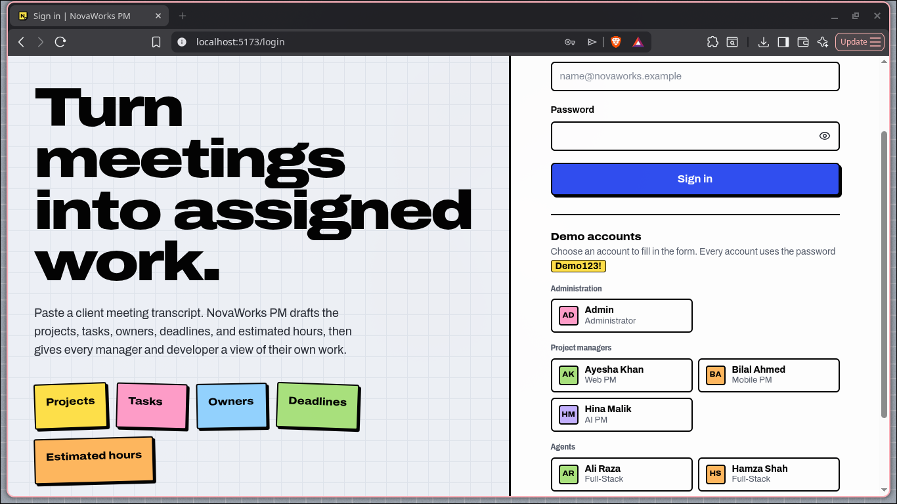
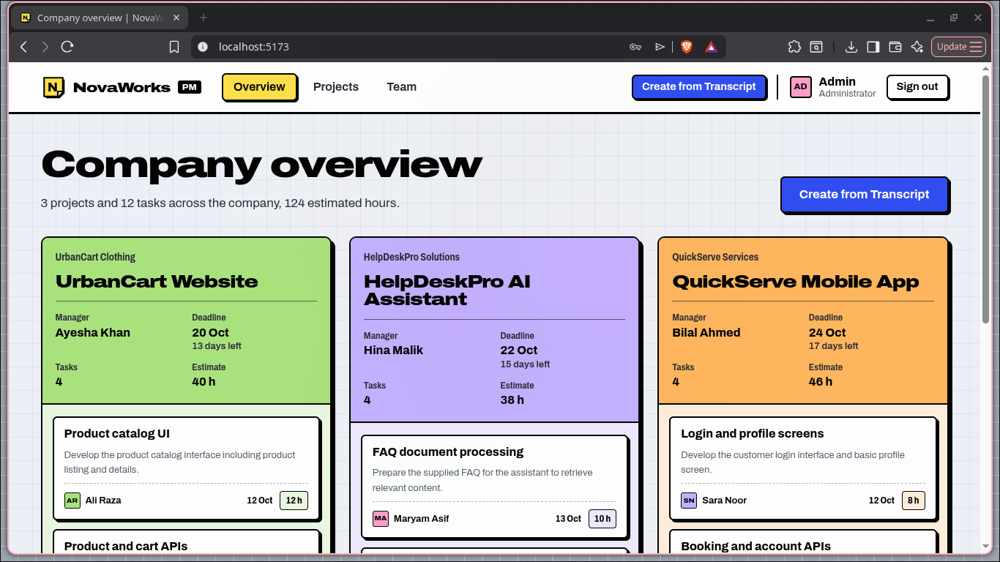
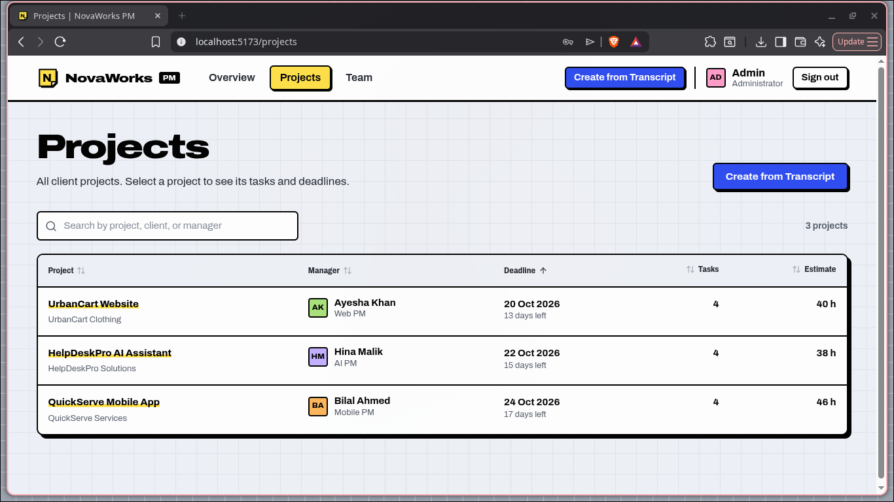
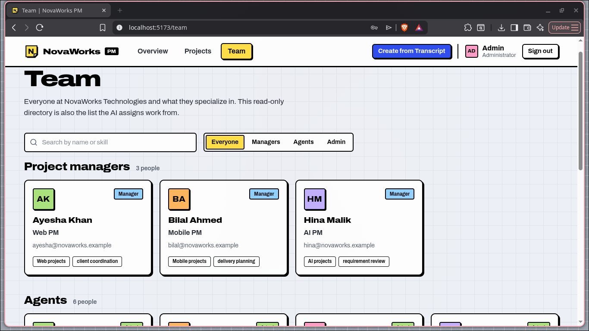

# NovaWorks PM

> **AI Project Manager** — The Infinity Hack '26

Turn a meeting transcript into structured projects, tasks, owners, deadlines, and hour estimates — in seconds. Every manager and developer sees only the work that belongs to them.

---

## Screenshots

### Login


### Dashboard Overview


### Projects


### Team


---

## How it works

1. The **Admin** pastes a raw client meeting transcript.
2. The AI (via OpenRouter / OpenAI) extracts projects, tasks, assignees, deadlines and estimates — resolving names against the live team directory.
3. If anything can't be resolved, the admin sees a correction form before anything is saved.
4. All-or-nothing save: either every project and task is created, or nothing is.
5. Managers see only their projects. Agents see only their tasks.

---

## Stack

| Layer | Technology |
|---|---|
| Backend | Python 3.12+, FastAPI, SQLAlchemy 2, Pydantic 2, Uvicorn |
| Database | PostgreSQL on Aiven (SQLite for local dev, zero config) |
| Auth | Signed HTTP-only session cookie, bcrypt password hashes |
| AI | OpenRouter / OpenAI / Groq / Anthropic / Gemini via a single adapter |
| Frontend | React 18, TypeScript, Vite, React Router |

---

## Local Setup

Prerequisites: **Python 3.12+**, **Node 18+**

```bash
git clone https://github.com/0xGhost63/Infinity-Hackathon.git
cd Infinity-Hackathon
```

**1. Backend**

```bash
cd backend
python3 -m venv .venv
source .venv/bin/activate          # Windows: .venv\Scripts\activate
pip install -r requirements.txt
python -m app.seed                 # creates tables + 10 demo users
.venv/bin/uvicorn app.main:app --reload --port 8000
```

**2. Frontend** (new terminal)

```bash
cd frontend
npm install
npm run dev -- --host 0.0.0.0     # http://localhost:5173
```

> The Vite dev server proxies all `/api/*` requests to `http://localhost:8000` automatically.

API docs: http://localhost:8000/api/docs

---

## Environment Variables

Copy `.env` and fill in your values:

| Variable | Required | Description |
|---|---|---|
| `APP_ENV` | yes | `development` or `production` |
| `DATABASE_URL` | prod only | Aiven PostgreSQL Service URI. Leave empty locally to use SQLite. |
| `SESSION_SECRET` | prod only | `python -c "import secrets; print(secrets.token_hex(32))"` |
| `LLM_PROVIDER` | yes | `openrouter`, `openai`, `groq`, `anthropic`, or `gemini` |
| `LLM_API_KEY` | yes | Your provider API key |
| `LLM_MODEL` | yes | e.g. `openai/gpt-4o-mini` |
| `LLM_BASE_URL` | no | Leave empty to use provider default |
| `LLM_TIMEOUT_SECONDS` | no | Default: `120` |

---

## Demo Accounts

Password for every account: **`Demo123!`**

| Role | Name | Email |
|---|---|---|
| Administrator | Admin | admin@novaworks.example |
| Manager (Web) | Ayesha Khan | ayesha@novaworks.example |
| Manager (Mobile) | Bilal Ahmed | bilal@novaworks.example |
| Manager (AI) | Hina Malik | hina@novaworks.example |
| Agent | Ali Raza | ali@novaworks.example |
| Agent | Hamza Shah | hamza@novaworks.example |
| Agent | Sara Noor | sara@novaworks.example |
| Agent | Usman Tariq | usman@novaworks.example |
| Agent | Zain Abbas | zain@novaworks.example |
| Agent | Maryam Asif | maryam@novaworks.example |

---

## Testing the Transcript Feature

1. Log in as `admin@novaworks.example`
2. Go to **Create from Transcript** and paste the transcript from `backend/tests/fixtures/transcript.txt`
3. Click **Create** — processing takes ~30–60 seconds
4. **Expected result:** 3 projects, 12 tasks
   - UrbanCart Website (Ayesha Khan, deadline 2026-10-20, 40h)
   - QuickServe Mobile App (Bilal Ahmed, deadline 2026-10-24, 46h)
   - HelpDeskPro AI Assistant (Hina Malik, deadline 2026-10-22, 38h)
5. Log in as **Ayesha** → sees only UrbanCart. As **Ali** → sees only his 3 tasks.

---

## Running Tests

```bash
cd backend
source .venv/bin/activate
python -m pytest -q                        # 21 tests: validation, access, atomic save
python scripts/eval_transcript.py --runs 3 # real AI eval vs answer key
```

---

## Known Limitations

- Submitting the same transcript twice creates duplicate projects (by design). Run `python -m app.reset` to clear all projects and tasks.
- Projects and tasks cannot be edited or deleted from the UI.
- The AI step depends on provider availability. On failure, nothing is saved.
